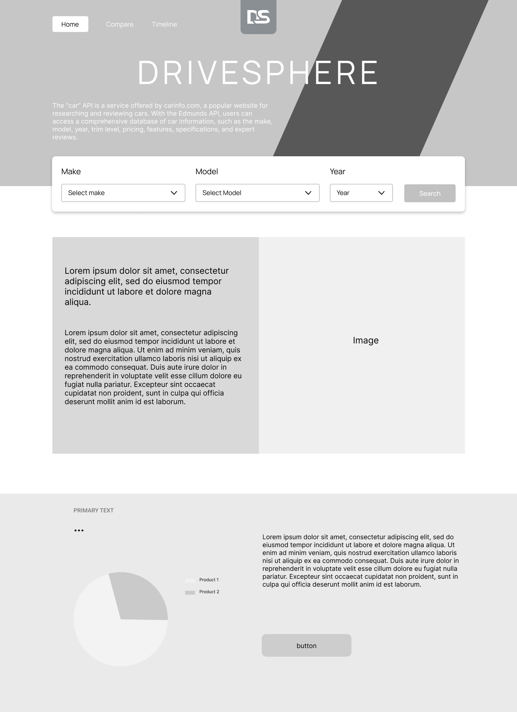
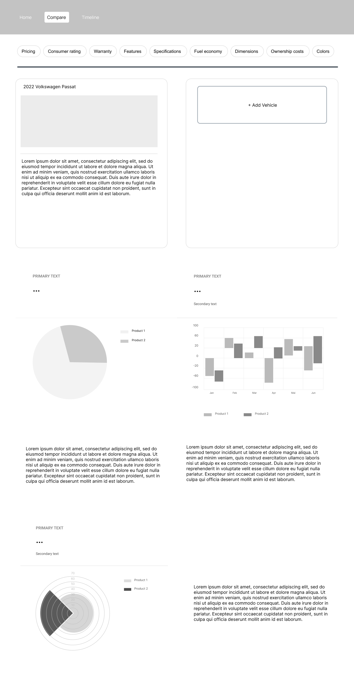
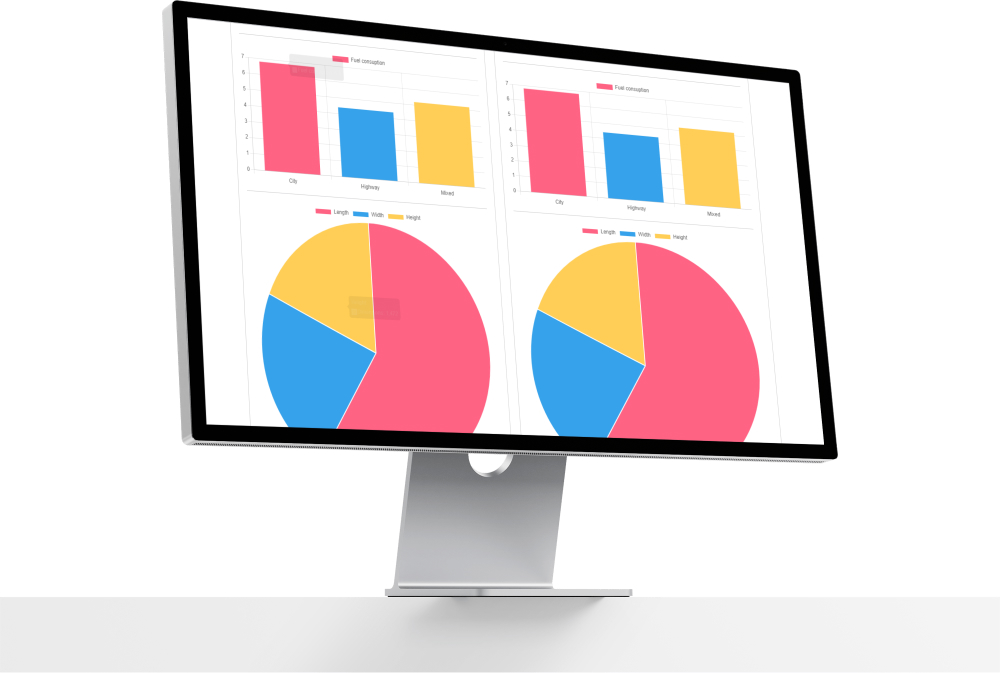
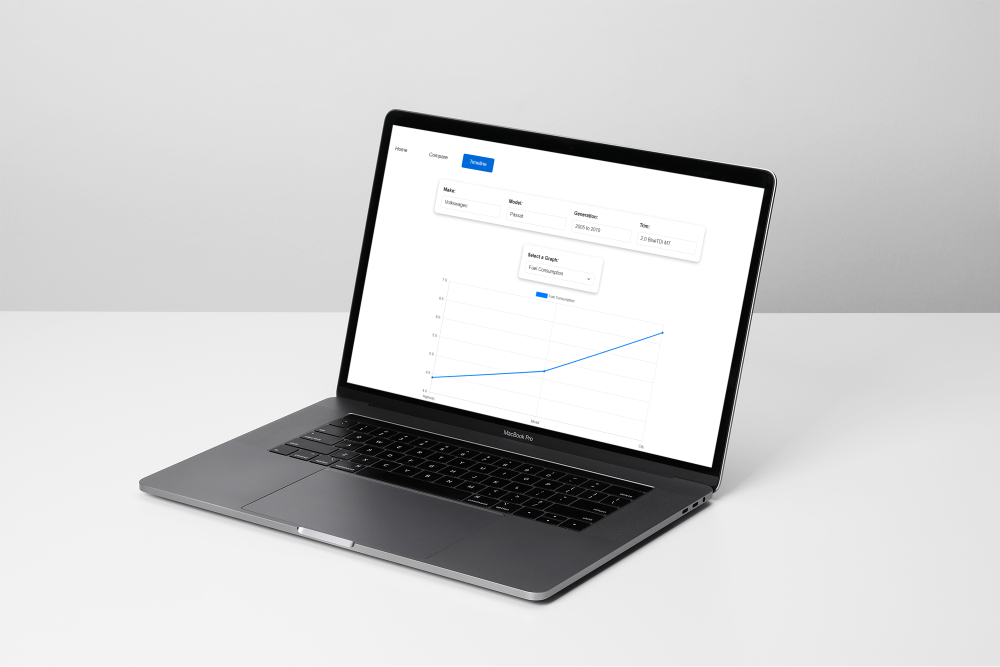
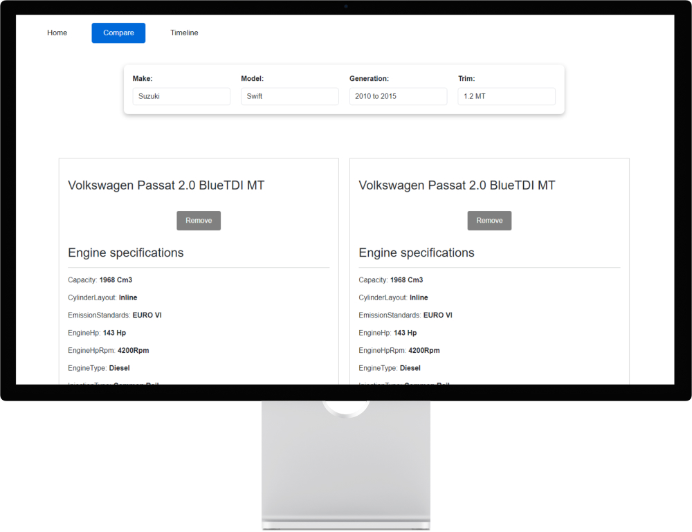
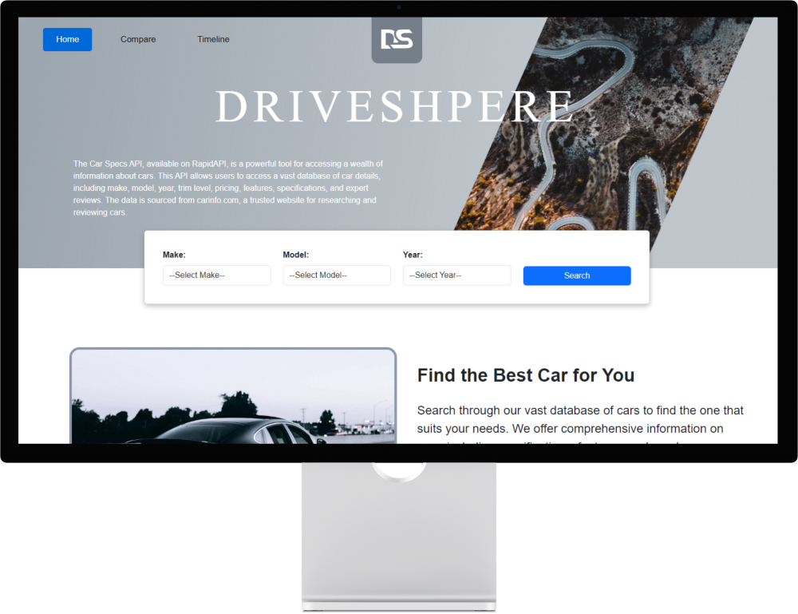

<!-- HEADER SECTION -->
<h5 align="center" style="padding:0;margin:0;">Luca Breebaart</h5>
<h5 align="center" style="padding:0;margin:0;">Student Number 221345</h5>
<h6 align="center">DV200 2023</h6>
</br>
<p align="center">

  <a href="https://github.com/username/projectname">
    
  </a>
  
  <h3 align="center">DriveSphere</h3>

  <p align="center">
   Using our website you can search through our vast database of cars to find the one that suits your needs. We offer comprehensive information on cars, including specifications, features, and graphs displaying relevant and informative information. 
    <br>
   <br>
      <a href="https://github.com/luca-breebaart/DriveSphere"><strong>Explore the docs »</strong></a>
   <br />
   <br>
   <a href="//">View Demo Video</a>
   <br />
    
    
</p>
<!-- TABLE OF CONTENTS -->
<h3>Table of Contents</h3>

* [About the Project](#about-the-project)
  * [Project Description](#project-description)
  * [Built With](#built-with)
* [Getting Started](#getting-started)
  * [Prerequisites](#prerequisites)
  * [How to install](#how-to-install)
* [Features and Functionality](#features-and-functionality)
* [Concept Process](#concept-process)
   * [Wireframes](#wireframes)
* [Development Process](#development-process)
   * [Implementation Process](#implementation-process)
        * [Highlights](#highlights)
        * [Challenges](#challenges)
   * [Future Implementation](#peer-reviews)
* [Final Outcome](#final-outcome)
    * [Mockups](#mockups)
    * [Video Demonstration](#video-demonstration)
* [Conclusion](#conclusion)

<!--PROJECT DESCRIPTION-->
## About the Project
<!-- header image of project -->
<br>

<br>

### Project Description

This is a website that allows users to search for cars and compare their specifications. It includes three pages: Home, Compare, and Timeline, all of which. The Car Specs API, available on RapidAPI, is a powerful tool for accessing car information. This API allows users to access a vast database of car details, including make, model, year, trim level, pricing, features, specifications, and expert reviews. Using this data, specs on each vehicle are displayed using chart.js on this site.

### Built With

* React(path/to/technology/website)
* [Technology Name](path/to/technology/website)
* [Technology Name](path/to/technology/website)

<!-- GETTING STARTED -->
<!-- Make sure to add appropriate information about what prerequisite technologies the user would need and also the steps to install your project on their own machines -->
## Getting Started

The following instructions will get you a copy of the project up and running on your local machine for development and testing.

### Prerequisites

Before getting started, ensure you have the following software installed:

- [React](https://react.dev/learn/installation)
- [Chart.js](https://www.chartjs.org/docs/latest/getting-started/installation.html)
- [React Router](https://reactrouter.com/en/main)

### How to install

### Installation
Here are a couple of ways to clone this repo:

1. Software </br>
Create a working folder in which you want this file saved. Then open the folder

`Visual Studio Code` -> `File` -> `Open` -> `Folder Name`</br>

2. Clone Repository </br>
Run the following in the command-line in the terminal to clone the project:
   ```sh
   git clone https://github.com/luca-breebaart/DriveSphere.git
   ```
    Then `cd Drivesphere`

3. Install Dependencies </br>
Run the following in the command-line to install all the required dependencies:
   ```sh
   npm install
   ```

4. Get a free API Key at [https://rapidapi.com/](https://rapidapi.com/alekivanovski96-O1vKHrFskQm/api/car-specs/) and replace ```"APIKEY"``` with your API key.


<!-- FEATURES AND FUNCTIONALITY-->

## Features and Functionality

### Home Page
The home page provides an overview of the website and its features. It includes a header with a navigation bar, a logo, and an image. There is also a description of the Car Specs API, which is used to access a vast database of car details.
The page includes a search form, where users can select a make, model, and year to find a car. 

###Compare Page

Users can select a car make, model, generation, and trim using dropdown menus.

When a user adds a car, the technical specifications and dimensions of that car are displayed in a card. The comparison card also includes three charts:
 - A bar chart showing city, highway, and combined fuel economy for the selected car.

 - A pie chart showing the length, width, and height of the selected car.

- A polar area chart showing the number of cylinders, gears, and valves per cylinder for the selected car.

### Timeline Page

The user can select a car make, model, generation, and trim, and the application retrieves the car specifications from the API and displays them in a graph format using Chart.js. The Web page also allows the user to switch between the different graphs; Fuel consumption, acceleration and range

The goal of this application is to provide users with an easy way to compare and visualize the specifications of different car models.


## Concept Process

### Wireframes


<br>

<br>

<br>

## Development Process

### Implementation Process

#### Highlights
- Feature Integration: Successfully integrated the Car Specs API, enabling access to a comprehensive database of car details.

- Data Visualization: Implemented Chart.js to create interactive and informative charts displaying car specifications.

- User Interface Development: Designed an intuitive user interface providing a seamless experience for users navigating the website.

#### Challenges

- API Integration: Facing difficulties in setting up and managing the Car Specs API to get the right information effectively.

- Data Display: Balancing between showing enough details and keeping it easy to understand for users.

- Responsive Design: Making sure the website works well on different devices and screen sizes was a challenge.

### Future Implementation

- Expanded Data Visualization: Adding more visual elements to present data for better comprehension. Such as adding images to the selected car.

- Optimization: Streamlining code and processes for better performance and scalability.

- Additional API Integration: Integrating additional APIs to expand the range of available data and features.

<!-- MOCKUPS -->
## Final Outcome

### Mockups


<br>

<br>

<br>

<br>

<!-- VIDEO DEMONSTRATION -->
### Video Demonstration

To see a run-through of the application, click below:

[View Demonstration](path/to/video/demonstration)

<!-- AUTHORS -->
## Authors

* **Luca Breebaart** - [luca-breebaart](https://github.com/luca-breebaart)
